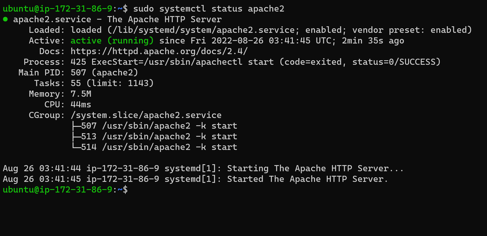

# Project 1 - LAMP Stack Implementation

## Step 1 - Apache & Firewal 

### Install Apache & Verify
- Update EC2 ubuntu server: 
    ```
    sudo apt update
    ```
- Install Apache Webserver software: 
    ```
    sudo apt install apache2
    ```
- Verify Installation: 
    ```
    sudo systemctl status apache2
    ```
    


### Open Server's Port 80 in AWS Console for http access
- Go to security group attached to EC2 instance.
- Edit inbound rules
- Add connection type of `http` to rule and make it accessible from any ip4 Address.

- Check that it works in terminal: `curl http://localhost:80`

- Check with browser using server's Public DNS: `ec2-44-201-195-137.compute-1.amazonaws.com` OR using IP Address: `44.201.195.137`


---

## Step 2 - MySQL

### Install MySQL server software in EC2 instance via terminal
- Install MySQL Server Software: 
    ```
    sudo apt install mysql-server
    ```
- Login to MySQL: 
    ```
    sudo mysql
    ```
    


### Secure MySQL root account with password
- Set root user password: 
    ```
    ALTER USER 'root'@'localhost' IDENTIFIED WITH mysql_native_password BY 'DeFPassyWord_1';
    ```
    
- Exit MySQL Shell: 
    ```
    exit
    ```

### Remove insecure default setting with pre-installed security script
- Start script: 
    ```
    sudo mysql_secure_installation
    ```
- Follow and respond to prompts to setup according to preference.

- Login with `-p` flag to prompt for password and verify everything works well.
    ```
    sudp mysql -p
    ```
    
- Exit MySQL Shell: 
    ```
    exit
    ``` 

---

## Step 3 - PHP


### Install PHP and required dependencies for communicating with MySQL & Apache
- Install core `php` package, `php-mysql` to communicate with MySQL Databases, & `libapache2-mod-php` to enable Apache web server handle PHP files, all with one command: 
    ```
    sudo apt install php libapache2-mod-php php-mysql
    ```
- Confirm installation with: 
    ```
    php -v
    ```
    


---


## Step 4 - Create Virtual Host for Website with Apache


### Setup Website Domain `myfirstlamp` 
- Create domain configuration direction: 
    ```
    sudo mkdir /var/www/myfirstlamp
    ```
- Assign ownership of the directory to current system user:
    ```
    sudo chown -R $USER:$USER /var/www/myfirstlamp
    ```
- Create & edit configuration file in Apache's `sites-available` directory:
    ```
    sudo vi /etc/apache2/sites-available/myfirstlamp.conf
    ```
- Enter the following configuration code:
    ```
    <VirtualHost *:80>
        ServerName myfirstlamp
        ServerAlias www.myfirstlamp
        ServerAdmin webmaster@localhost
        DocumentRoot /var/www/myfirstlamp
        ErrorLog ${APACHE_LOG_DIR}/error.log
        CustomLog ${APACHE_LOG_DIR}/access.log combined
    </VirtualHost>
    ```
- Verify configuration file:
    ```
    sudo cat /etc/apache2/sites-available/myfirstlamp.conf
    sudo ls /etc/apache2/sites-available
    ```
    
- Enable new virtual host:
    ```
    sudo a2ensite myfirstlamp
    ```
- Disable default apache website:
    ```
    sudo a2dissite 000-default.conf
    ```
- Test for sysntax errors in conf file:
    ```
    sudo apache2ctl configtest
    ```
- Results:
    
- Reload Apache:
    ```
    sudo systemctl reload apache2
    ```
- Create `index.html` in `/var/www/myfirstlamp` to test virtual host:
    ```
    sudo echo 'Hello LAMP from hostname' $(curl -s http://169.254.169.254/latest/meta-data/public-hostname) 'with public IP' $(curl -s http://169.254.169.254/latest/meta-data/public-ipv4) > /var/www/myfirstlamp/index.html
    ```
- Check with browser using server's Public DNS: `ec2-44-201-195-137.compute-1.amazonaws.com` OR using IP Address: `44.201.195.137`


---

## Step 5 - Enable PHP on Website


### Change precedence of PHP files & Test PHP Configuration
- Edit Apache DirectoryIndex configuration file:
    ```
    sudo nano /etc/apache2/mods-enabled/dir.conf
    ```
- Change the order in which the file extensions are listed from:
    ```
    <IfModule mod_dir.c>
        DirectoryIndex index.html index.cgi index.pl index.php index.xhtml index.htm
    </IfModule>
    ```
    to:
    ```
    <IfModule mod_dir.c>
        #DirectoryIndex index.html index.cgi index.pl index.php index.xhtml index.htm
        DirectoryIndex index.php index.html index.cgi index.pl index.xhtml index.htm
    </IfModule>
    ```
- Reload Apache:
    ```
    sudo systemctl reload apache2
    ```
- Create & edit `index.php` file:
    ```
    nano /var/www/myfirstlamp/index.php
    ```
- Add PHP info code:
    ```
    <?php
        phpinfo();
    ?>
    ```
- Check with browser using server's Public DNS: `ec2-44-201-195-137.compute-1.amazonaws.com` OR using IP Address: `44.201.195.137`

- Remove PHP info file:
    ```
    sudo rm /var/www/myfirstlamp/index.php
    ```


---